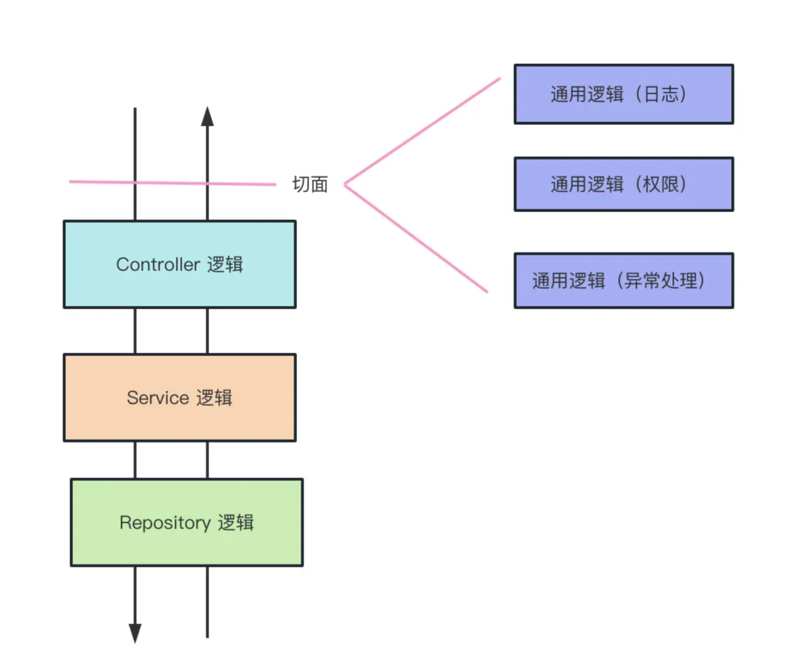
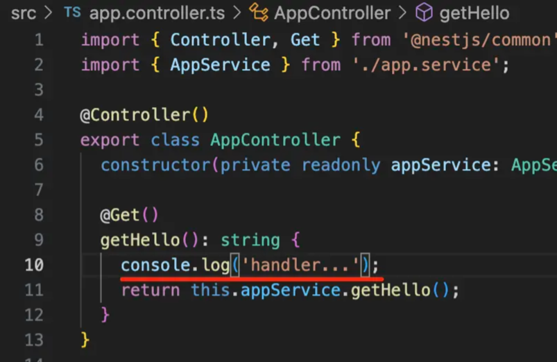

# AOP

Nest 还提供了 AOP （Aspect Oriented Programming）的能力，也就是面向切面编程的能力。

什么是面向切面编程呢？

一个请求过来，可能会经过 Controller（控制器）、Service（服务）、Repository（数据库访问） 的逻辑：

如果想在这个调用链路里加入一些通用逻辑该怎么加呢？比如日志记录、权限控制、异常处理等。

容易想到的是直接改造 Controller 层代码，加入这段逻辑。

这样可以，但是不优雅，因为这些通用的逻辑侵入到了业务逻辑里面。能不能透明的给这些业务逻辑加上日志、权限等处理呢？

那是不是可以在调用 Controller 之前和之后加入一个执行通用逻辑的阶段呢？



这样的横向扩展点就叫做切面，这种透明的加入一些切面逻辑的编程方式就叫做 AOP （面向切面编程）。

## nest 中的 AOP

Nest 实现 AOP 的方式更多，一共有五种，包括 Middleware、Guard、Pipe、Interceptor、ExceptionFilter。

## 中间件 Middleware

中间件是 Express 里的概念，Nest 的底层是 Express，所以自然也可以使用中间件，但是做了进一步的细分，分为了全局中间件和路由中间件。

**全局中间件**就是这样：在 main.ts 里通过 app.use 使用

```ts
app.use(function(req: Request, res: Response, next: NextFunction) {
  console.log('before', req.url);
  next();
  console.log('after');
})
```

在 AppController 里也加个打印：



执行的结果：
before：/
handler
after

除了全局中间件，Nest 还支持路由中间件。

```ts
import { Injectable, NestMiddleware } from '@nestjs/common';
import { Request, Response } from 'express';

@Injectable()
export class LogMiddleware implements NestMiddleware {
  use(req: Request, res: Response, next: () => void) {
    console.log('before2', req.url);

    next();

    console.log('after2');
  }
}
```